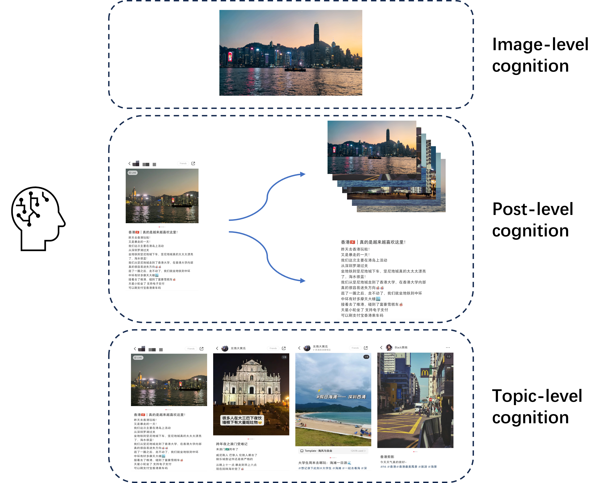

# Text-Image Cognitive Framework


Code for paper: "*Hierarchical Text-Image Cognitive Framework for Social Media: A Case Study on Scenic Spot Posts in RED*". 

This paper proposed a Text-Image Cognitive Framework to simulate how people perceive scenic spots through RED posts. The framework uses advanced models to analyze images and text at different levels: image, post, and comprehensive. Comparing only pictures and only text, the framework achieves the highest scores regarding completeness and satisfaction.




## Usage

1. Clone the repository:

   ```
   git clone https://github.com/BlackThompson/scenic_spot_analysis.git
   ```

2. Create a new environment and install dependencies:

   - Python version should be >= 3.8.

   ```
   conda create --name cogframe python=3.8
   conda activate cogframe
   pip install -r requirements.txt
   ```

3. You can find the main code of the framework in `utils.py` and `run.ipynb`.

